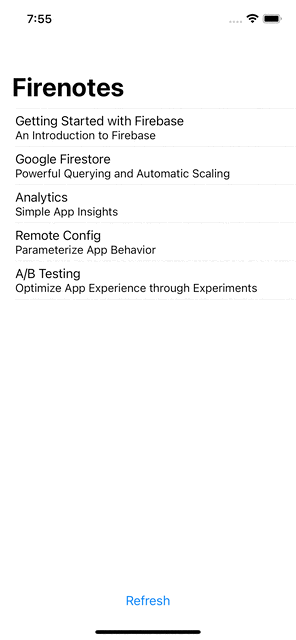
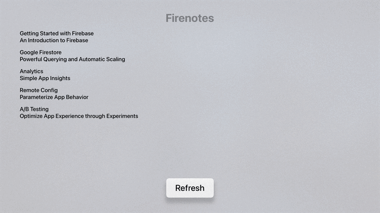
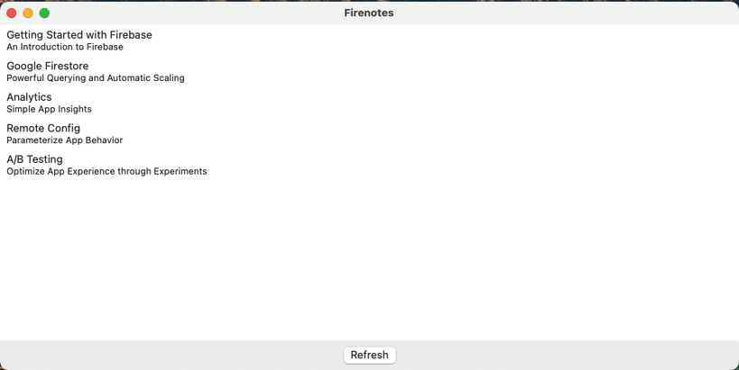
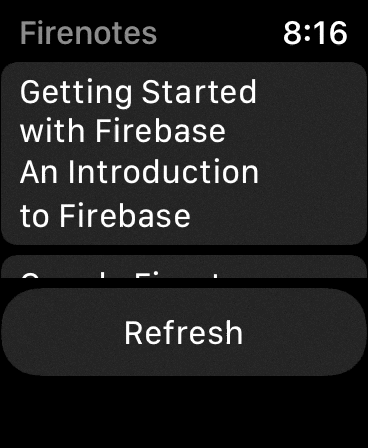
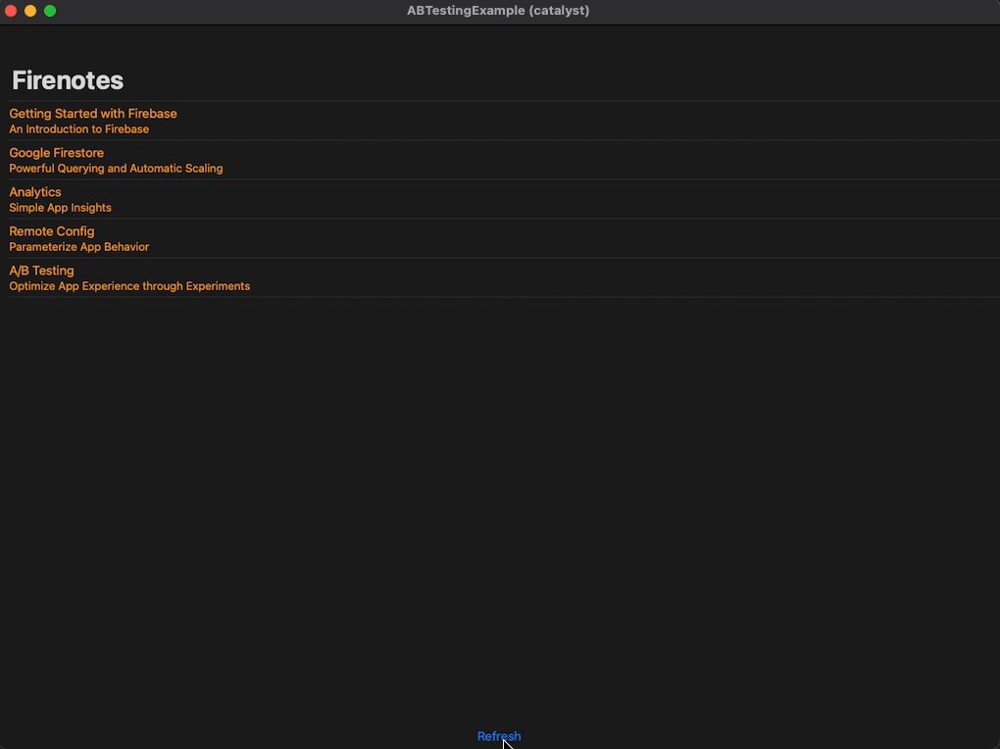

# A/B Testing Quickstart SwiftUI Media

## Table of Contents
- [iOS](#ios)
    - [Animation](#animation)
    - [ContentView - Light](#contentview---light)
    - [ContentView - Refreshing (iOS 15)](#contentview---refreshing-ios-15)
    - [ContentView - Dark](#contentview---dark)
- [tvOS](#tvos)
    - [Animation](#animation-1)
    - [ContentView - Light](#contentview---light-1)
    - [ContentView - Dark](#contentview---dark-1)
- [macOS](#macos)
    - [Animation](#animation-2)
    - [ContentView - Light](#contentview---light-2)
    - [ContentView - Dark](#contentview---dark-2)
- [watchOS](#watchos)
    - [Animation](#animation-3)
    - [ContentView - Light](#contentview---light-3)
    - [ContentView - Dark](#contentview---dark-3)
- [Mac Catalyst](#mac-catalyst)
    - [Animation](#animation-4)
    - [ContentView - Light](#contentview---light-4)
    - [ContentView - Dark](#contentview---dark-4)

## iOS

### Animation

### ContentView - Light

### ContentView - Refreshing (iOS 15)
.png)

### ContentView - Dark

## tvOS

### Animation

### ContentView - Light

### ContentView - Dark

## macOS

### Animation

### ContentView - Light

### ContentView - Dark

## watchOS

### Animation

### ContentView - Light

### ContentView - Dark

## Mac Catalyst

### Animation

### ContentView - Light

### ContentView - Dark
