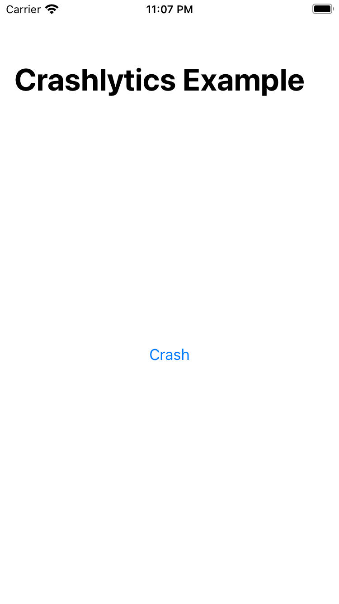
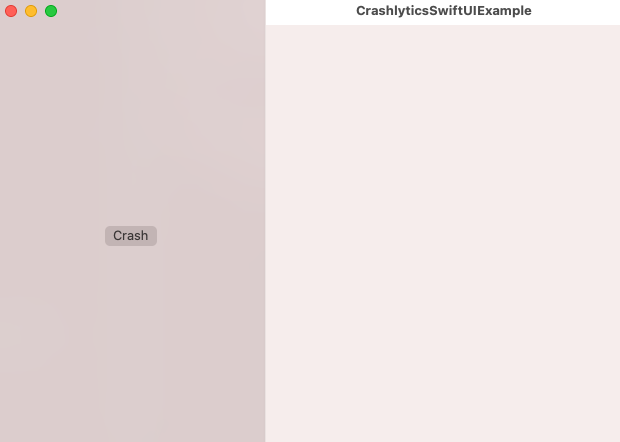
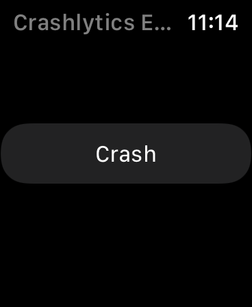

[Crashlytics] SwiftUI Design Doc
=================================
Guide to understanding Firebase Crashlytics SwiftUI Quickstart sample.

## File Structure

The entire Crashlytics Quickstart sample app is composed of three `.swift` files under the `Shared`
folder. Below are brief descriptions of the purpose for each file. 
- `CrashlyticsSwiftUIExampleApp.swift`: To initialize Firebase Crashlytics and Reachability.
- `ReachabilityHelper.swift`: Contains a series of functions that uses Reachability to retrieve
  information. 
- `ContentView.swift`: The main view of the app, with a button that will trigger a crash. 

## Multiplatform

The Crashlytics Quickstart provide cross platform example apps in iOS, macOS, tvOS, and watchOS.
Below are the screenshots for selected build schemes: 

- CrashlyticsExample (iOS)
     
- CrashlyticsExample (macOS)
     
- CrashlyticsExample (tvOS)
     
- CrashlyticsExample (watchOS)
     