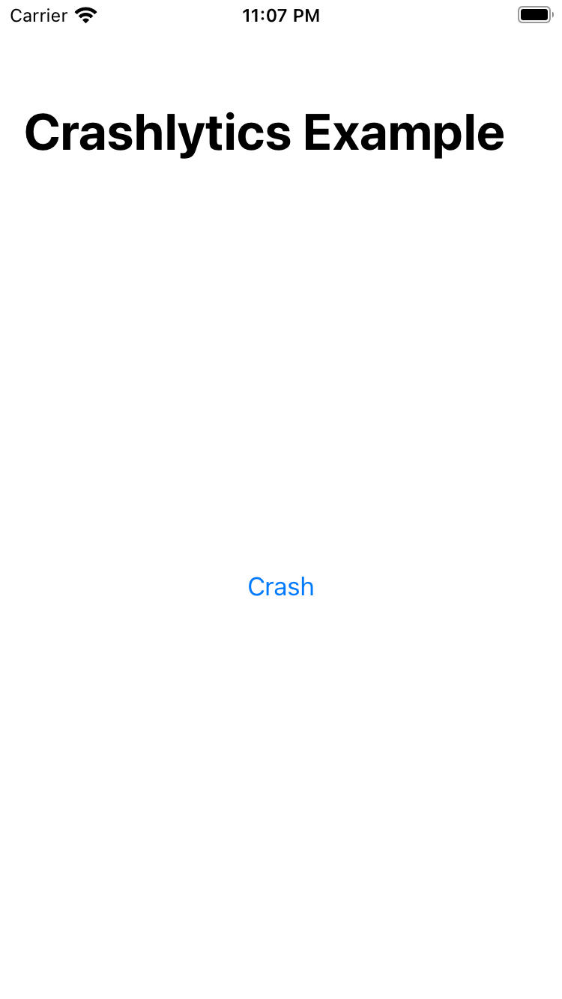
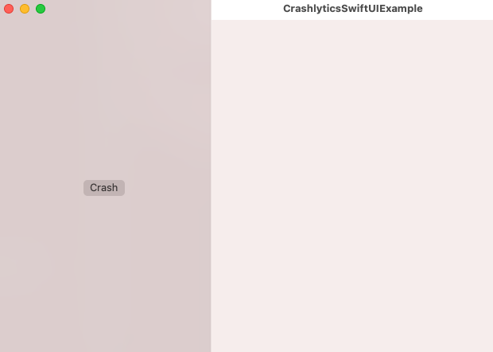
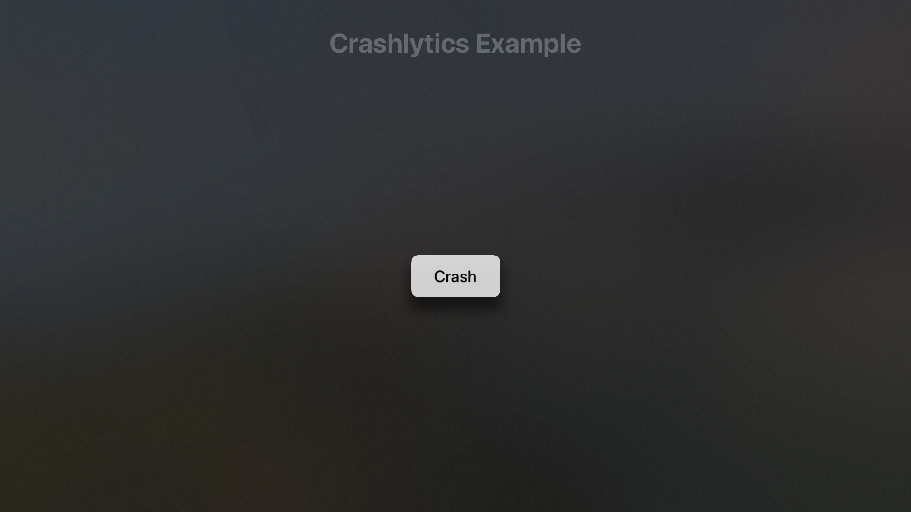
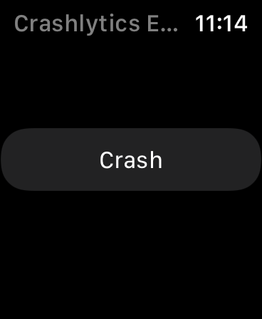

Crashlytics Quickstart SwiftUI Outline
=================================
Guide to understanding Firebase Crashlytics SwiftUI Quickstart sample.

# Introduction

## Context
This document presents the design for the SwiftUI version of the [Firebase Crashlytics
Quickstart](https://github.com/firebase/quickstart-ios/tree/main/crashlytics), an app that
demonstrates the use of [Firebase Crashlytics](https://firebase.google.com/docs/crashlytics). It is
available on all Apple platforms (iOS, macOS, tvOS, watchOS). This SwiftUI version of the Quickstart
is made using Apple’s latest frameworks and tools (SwiftUI, Swift Package Manager) that are rapidly
gaining adoption within the Apple dev community. 

## Design

### Overview
The Crashlytics Quickstart sample app is a lightweight app that developers can use as a
reference Crashlytics implementation. Each crash is triggered by the crash button, and will generate
a customized crash report to the Firebase Console. Apart from the default crash information (device,
operating system, time of crash), the crash report contains custom keys and logs (userID, location,
network status) which can help developers to debug the crash as well as illustrate how to add custom
data to their own crashes. 

### Reachability
There are many reasons behind a crash, and developers are challenged to understand the root cause
behind the crash in order to apply the proper fix. Thus, receiving different types of information
from the crash can help developers to understand the crash. Reachability gives information about a
device’s network configuration settings.
[Reachability.swift](https://github.com/ashleymills/Reachability.swift) uses the [System
Configuration](https://developer.apple.com/documentation/systemconfiguration) framework to monitor
the network state of a device. It is a replacement for [Apple's
Reachability](https://developer.apple.com/library/archive/samplecode/Reachability/Introduction/Intro.html#//apple_ref/doc/uid/DTS40007324)
(written in Objective-C) re-written in Swift with closures. 

### Cross Platform
This Quickstart supports all Apple platforms including iOS, macOS, tvOS and watchOS. The SwiftUI
code can be shared across those platforms.

### WatchOS Exceptions
One exception is the omission of Reachability.swift on watchOS. Reachability.swift uses Apple’s
System Configuration framework, which currently does not support watchOS. 

This Quickstart Sample App’s Bundle Identifier is `com.google.firebase.quickstart.CrashlyticsExample` for iOS,
macOS, and tvOS targets. But the Bundle Identifier for watchOS target is
`com.google.firebase.quickstart.CrashlyticsExample.watchkitapp`. This means that to generate and view crash logs
onto the Firebase console, a new app in Firebase with the full bundle ID will be needed. 

## File Structure
The entire Crashlytics Quickstart sample app is composed of three `.swift` files under the `Shared`
folder. Below are brief descriptions of the purpose for each file. 

- `CrashlyticsSwiftUIExampleApp.swift`: Contains `App` struct which is the main point of entry into
  the app, where Firebase, Firebase Crashlytics and Reachability are initialized.  
- `ReachabilityHelper.swift`: Contains a series of helper functions that use Reachability to
  retrieve current device’s network information. 
- `ContentView.swift`: The main view of the app, contains a button that can trigger a crash. 

## Screenshots

The Crashlytics Quickstart provide cross platform example apps in iOS, macOS, tvOS, and watchOS.
Below are the screenshots for selected build schemes:

### CrashlyticsExample (iOS)
 

### CrashlyticsExample (macOS)
 

### CrashlyticsExample (tvOS)
 

### CrashlyticsExample (watchOS)
 