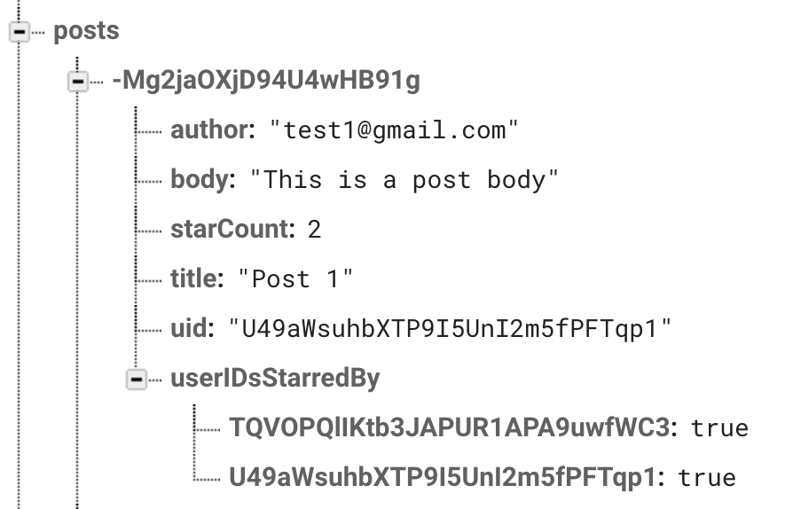
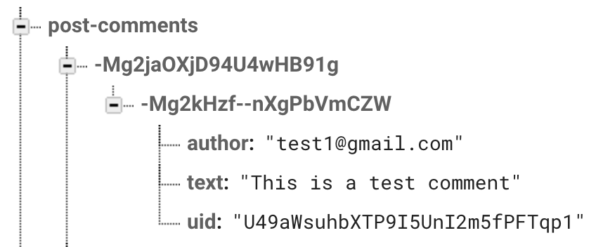

[Realtime Database] SwiftUI Design Doc
=======================================
Guide to understanding Firebase Realtime Database SwiftUI Quickstart sample

## Data Flow Chart

## Database Structure

### Posts
- A list of posts identified by a unique key (post-id), and each post contains a dictionary with the
  following structure: [“author”, “body”, “starCount”, “title”, “uid”, “userIDsStarredBy”]
- post-ids are generalized as posts are created, sorting them would yield a list of posts from most
  to least recent.
- Example: 

### Post-comments
- A list of posts identified by a unique key (post-id), each post is composed of a list of comments
  identified by a unique key (comment-id), and each comment contains a dictionary with [“author”,
  “text”, “uid”].
- Comment-ids are generalized as comments are sent, sorting them would yield a list of comments from
  most to least recent.
- Example: 

### User-posts
- A list of posts organized by “uid” (user-ids) that are unique to each user.
- Since the posts are grouped by users, it is easy to fetch and sort posts from a single user.
- Example: 
