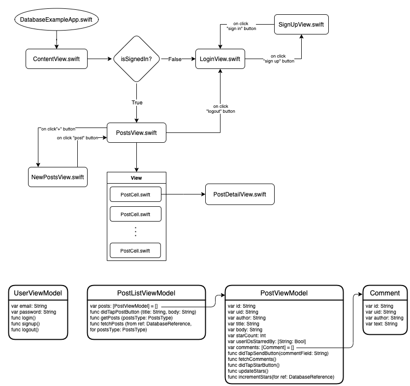
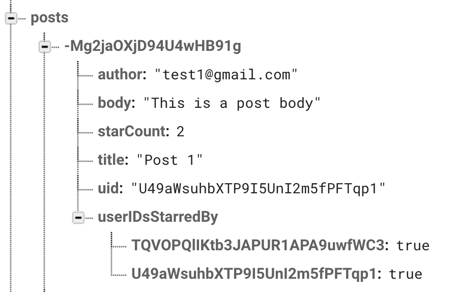
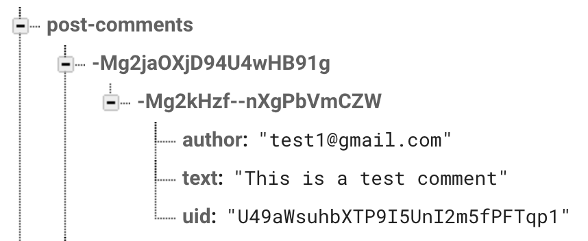
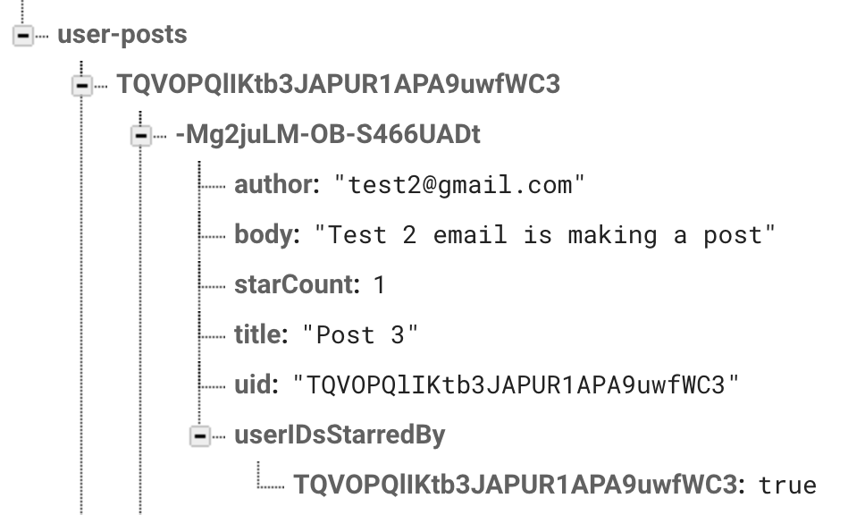

[Realtime Database] SwiftUI Design Doc
=======================================
Guide to understanding Firebase Realtime Database SwiftUI Quickstart sample

## Data Flow Chart

## Database Structure

### All posts
- The `posts` category contains every post made in history. It is organized as a dictionary identified by a unique key (post-id), and each post contains a dictionary with the
  following structure: `[“author”, “body”, “starCount”, “title”, “uid”, “userIDsStarredBy”]`
- The unique keys (post-ids) are generalized as posts are created, sorting them would yield a list of posts from most
  to least recent.
- Example: 

### Comments on each post
- The `post-comments` category organizes every comment on each post. It starts with a dictionary of
  posts identified by a unique key (post-id), each post is composed of a list of comments identified
  by another unique key (comment-id), and each comment contains a dictionary with `[“author”,
  “text”, “uid”]`.
- Comment-ids are generalized as comments are sent, sorting them would yield a list of comments from
  most to least recent.
- Example: 

### Posts grouped by users
- The `user-posts` category is a list of posts organized by “uid” (user-ids) that are unique to each
  user.
- Since the posts are grouped by users, it is easy to fetch and sort posts from a single user.
- Example: 
