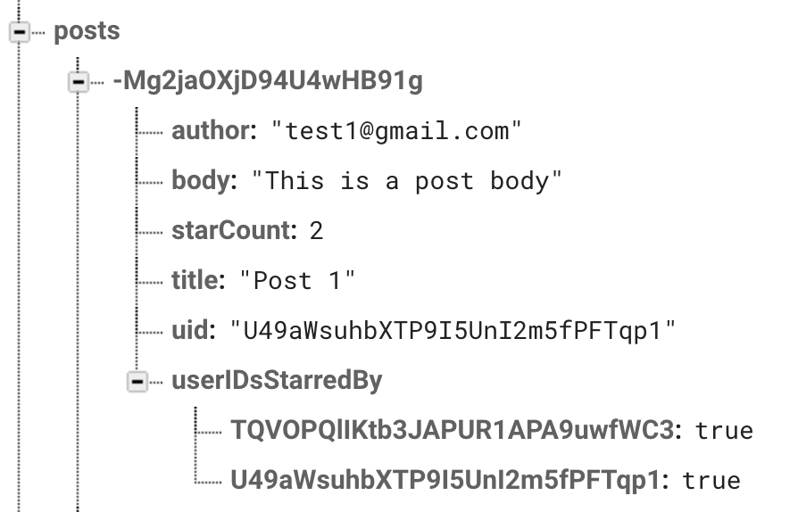
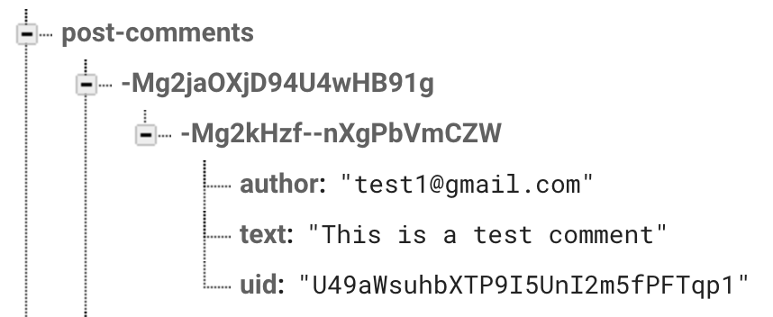

[Realtime Database] SwiftUI Design Doc
=======================================
Guide to understanding Firebase Realtime Database SwiftUI Quickstart sample

## Introduction
### Context
This document presents the design for the SwiftUI version of the Firebase Realtime Database
Quickstart, an app that demonstrates the use of Firebase Database. It is available on multiple Apple
platforms (iOS, macOS, tvOS). This SwiftUI version of the Quickstart is made using Apple’s latest
frameworks and tools (SwiftUI, Swift Package Manager) that are rapidly gaining adoption within the
Apple dev community.
### Design
The Realtime Database Quickstart app is a toy app that teaches users how to integrate firebase
databases into their apps. A sample usage for the app would be when a user logs in or signs up for
an account, in which they will see a list of posts from themselves or other users. They can choose
to only view their own posts and sort them from most to least popular. In addition they can like and
comment on each post.
The basic app not only shows you how to implement realtime database applications but also some of
the best practices that developers should follow when using SwiftUI, which includes the Model View
Viewmodel data flow, the multiplatform shared code, extensions, and async/await feature implemented
in the most recent project. 
### Data Flow
The Firebase Quickstart Sample app follows the Model-View-ViewModel structure (MVVM) to cleanly
separate the user interface from the application logic. MVVM contains three layers: the Model layer
represents the app’s data and its domain business logic, the View layer is what users will see on
the screen and interact with directly, and the ViewModel connects a view to the app’s model.
ViewModel is oftentimes the most complicated layer since it contains the current state of the view,
links to other parts of an app’s architecture, and handles the user interaction.

Model types only contain data and the code that manipulates it, they do not know anything about data
storage, networking, or how data is presented to the user.
- `Comment.swift`

View can be implemented with SwiftUI syntax
- `ContentView.swift`
- `NewPostsView.swift`
- `PostCell.swift`
- `PostDetailView.swift`
- `PostsView.siwft`
- `LoginView.swift`
- `SignUpView.swift`

ViewModel connects the model and view together and performs network requests to write and fetch
posts. They conform to the `ObservableObject` protocol and publish its property using the
`@Published` property wrapper. This is the “binder” part of MVVM.
- `PostListViewModel.swift`
- `PostViewModel.swift`
- `UserViewModel.swift`

### Cross Platform
This Quickstart supports multiple Apple platforms including iOS, macOS, tvOS. The SwiftUI code canbe
shared across those platforms.

### Extensions
Database reference is a crucial part in writing and retrieving data, thus the code where we
instantiate and define the ref variable appears on multiple lines throughout the project. Since this
is adding an extra layer of complexity, extensions can be used to simplify the code. 
SwiftUI’s Extension allows you to add methods to existing types, and to make them do things that
they weren’t originally designed to do. 

The `Database+Extensions.swift` file allows us to simplify the code from 
```
private var ref: DatabaseReference!
ref = DatabaseReference.database().reference()
```

into private `var ref = Database.root`

## Data Flow Chart
To have a better understanding of how each file interacts with each other, below is a flow chart
describing how the views interact with each other. 


## Database Structure

### All posts
- The `posts` category contains every post made in history. It is organized as a dictionary
  identified by a unique key (post-id), and each post contains a dictionary with the 
  following structure: `[“author”, “body”, “starCount”, “title”, “uid”, “userIDsStarredBy”]`
- The unique keys (post-ids) are generalized as posts are created, sorting them would yield a list
  of posts from most to least recent.
- Example: 

### Comments on each post
- The `post-comments` category organizes every comment on each post. It starts with a dictionary of
  posts identified by a unique key (post-id), each post is composed of a list of comments identified
  by another unique key (comment-id), and each comment contains a dictionary with `[“author”,
  “text”, “uid”]`.
- Comment-ids are generalized as comments are sent, sorting them would yield a list of comments from
  most to least recent.
- Example: 

### Posts grouped by users
- The `user-posts` category is a list of posts organized by “uid” (user-ids) that are unique to each
  user.
- Since the posts are grouped by users, it is easy to fetch and sort posts from a single user.
- Example: 