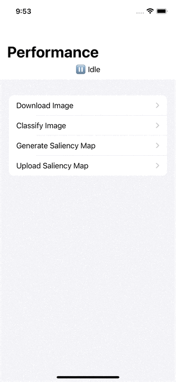

# Performance Monitoring Quickstart SwiftUI Media

## Table of Contents
- [iOS](#ios)
    - [Animation](#animation)
    - [MainView - Ready](#mainview---ready)
    - [ClassifyView & SaliencyMapView - Not Ready](#classifyview--saliencymapview---not-ready)
    - [UploadView - Not Ready](#uploadview---not-ready)
    - [DownloadView - Ready](#downloadview---ready)
    - [DownloadView - Success](#downloadview---success)
    - [ClassifyView - Ready](#classifyview---ready)
    - [ClassifyView - Success](#classifyview---success)
    - [SaliencyMapView - Ready](#saliencymapview---ready)
    - [SaliencyMapView - Success](#saliencymapview---success)
    - [UploadView - Ready](#uploadview---ready)
    - [UploadView - Running](#uploadview---running)
    - [UploadView - Success](#uploadview---success)
    - [MainView - Success](#mainview---success)
- [tvOS](#tvos)
    - [Animation](#animation-1)
    - [MainView - Ready](#mainview---ready-1)
    - [ClassifyView & SaliencyMapView - Not Ready](#classifyview--saliencymapview---not-ready-1)
    - [UploadView - Not Ready](#uploadview---not-ready-1)
    - [DownloadView - Ready](#downloadview---ready-1)
    - [DownloadView - Success](#downloadview---success-1)
    - [ClassifyView - Ready](#classifyview---ready-1)
    - [ClassifyView - Success](#classifyview---success-1)
    - [SaliencyMapView - Ready](#saliencymapview---ready-1)
    - [SaliencyMapView - Success](#saliencymapview---success-1)
    - [UploadView - Ready](#uploadview---ready-1)
    - [UploadView - Running](#uploadview---running-1)
    - [UploadView - Success](#uploadview---success-1)
    - [MainView - Success](#mainview---success-1)

## iOS
### Animation

### MainView - Ready

### ClassifyView & SaliencyMapView - Not Ready

### UploadView - Not Ready

### DownloadView - Ready

### DownloadView - Success

### ClassifyView - Ready

### ClassifyView - Success

### SaliencyMapView - Ready

### SaliencyMapView - Success

### UploadView - Ready

### UploadView - Running

### UploadView - Success

### MainView - Success

## tvOS
### Animation

### MainView - Ready

### ClassifyView & SaliencyMapView - Not Ready

### UploadView - Not Ready

### DownloadView - Ready

### DownloadView - Success

### ClassifyView - Ready

### ClassifyView - Success

### SaliencyMapView - Ready

### SaliencyMapView - Success

### UploadView - Ready

### UploadView - Running

### UploadView - Success

### MainView - Success
